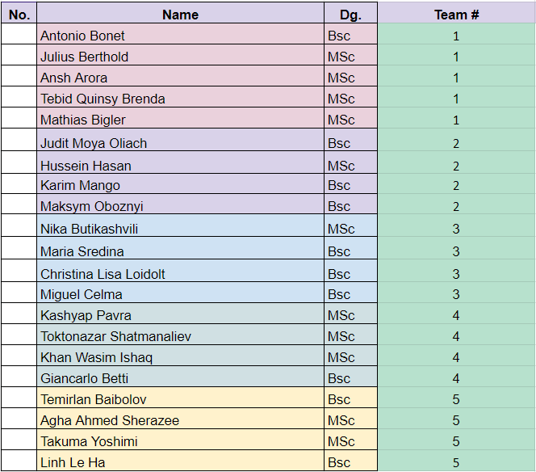

# Final Project (Dive into CSS)

> This project involves the translation of `Figma Designs` into `Pure-Semantic HTML and CSS`.

## Table of Contents

- [General Info](#general-information)
- [Technologies Used](#technologies-used)
- [Teams](#features)
- [Setup](#setup)
- [Usage](#usage)

## General Information

- There are 5 teams consisting of roughly 4 members.
- Each team is assigned 3 Figma Designs
- Each design has a desktop version and a mobile version
- Each design has to be translated into pure-semantic HTML/CSS
<!-- You don't have to answer all the questions - just the ones relevant to your project. -->

## Technologies Used

- HTML
- CSS

## Teams



<!--

## Screenshots

 -->

<!-- If you have screenshots you'd like to share, include them here. -->

## Setup

- Clone the repository

- Go to the cloned folder

- Install all the dependencies:

  `npm install`

## Usage

- Create a new branch:

  `git checkout -b [branchName]`

- Go to the `teams` directory/folder and make a folder corresponding to your `team number`

- Paste your HTML and CSS files into the folder

- Stage and commit all the changes:

  ```
  git add .

  git commit -m "[commitMessage]"
  ```

- Push the changes to the remote repo:

  `git push`

- Create a PR to the master branch from GitHub website
